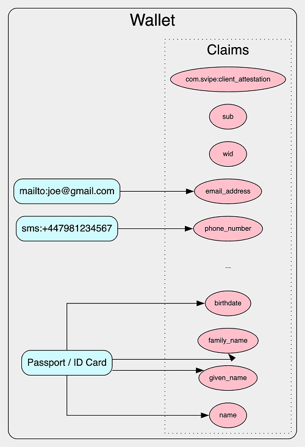

# iProov Identity SDK v0.2.0

The iProov Identity SDK enables you to create an iProov Identity wallet within your Android, iOS or Kotlin Multiplatform
app.

> [!WARNING]
> The iProov Identity SDK is currently a development preview, which means that there may be missing/broken
> functionality, and the API is still subject to change.
> No apps containing this SDK should be put into production without prior approval from iProov.
> We would welcome [your feedback](mailto:support@iproov.com) regarding the iProov Identity SDK preview.

## Requirements

- iOS: 13.0+
- Android: API Level 26+
- Kotlin Multiplatform: 2.2.0+

## Concepts and terminology

> [!IMPORTANT]
> Legacy credentials are deprecated and will be removed in a future release.

Before getting started with the iProov Identity SDK, it's worth familiarizing yourself with the following terminology
which describes the core functionality of the SDK:

- **Wallet** - the wallet is the core of the iProov Identity SDK. It holds all of your credentials and any claims
  associated with those credentials. You will only have one wallet for your entire app.

- **Credential** - a credential is an encapsulation of information issued, by a OID4VCI Draft 13 compliant issuer, in a
  specific format such as `mso_mdoc` and `jwt_vc_json-ld`. The only format that's supported currently is `mso_mdoc`.

- **LegacyCredential** - a legacy credential is a piece of information about a user. LegacyCurrently supported
  credentials are documents (specifically, NFC-enabled passports and ID cards following the ICAO 9303 standard), email
  addresses and phone numbers.

- **Claim** - a claim is an attribute that may be associated with a legacy credential (for example, a document will have
  claims `family_name` or `birthdate`, an email will have `email`, etc...). It is provided as
  a [Verifiable Credential](https://www.w3.org/TR/vc-data-model/) (VC). Each claim is provided as its own VC.
  Additionally, there are three special claims (`wid`, `sub` and `com.svipe:client_attestation`) that belong to the
  wallet itself and are not associated with any specific credential.

You can think of the relationships between the wallet, credentials and claims as follows:



## App registration

Before you're able to use the iProov Identity SDK, you must register your app with iProov. Currently, this is performed
as a manual process.

Please contact [support@iproov.com](mailto:support@iproov.com) with the following information:

- For iOS apps:
    - Your bundle (app) ID.
- For Android apps:
    - Your Android application ID.
    - The fingerprint of your Android
      app [signing key certificate](https://play.google.com/console/developers/app/keymanagement). (For further details,
      see [here](https://support.google.com/googleplay/android-developer/answer/9842756?hl=en-GB#:~:text=signing%20to%20continue.-,Step%203,-%3A%20Register%20your%20app)).

## Installation

1. The first step is to install the SDK according to your platform:

    <details>
    <summary>iOS (Swift Package Manager)</summary>

   Not currently supported, will be added in a future release. For now please follow the manual steps.
    </details>

    <details>
    <summary>iOS (Manual)</summary>

   

    1. Select your project in Xcode.

    2. Select your app target.

    3. Select the General tab and then scroll down to Frameworks, Libraries, and Embedded Content.

    4. Add identity.xcframework from the artifacts directory in the repository.

   > **Note**: Ensure you add the .xcframework file, rather than the .framework file.

    5. Add [JOSESwift](https://github.com/airsidemobile/JOSESwift) as a dependency
    6. Under the Embed column, ensure Embed & Sign is set.
    7. Follow installation instructions to add the iProov SDK to your app [here](https://github.com/iProov/iOS)

    </details>

    <details>
    <summary>Android</summary>

   Add the following to your project's `settings.gradle.kts` file:

    ```kotlin
    dependencyResolutionManagement {
      repositories {
          mavenCentral()
          maven("https://raw.githubusercontent.com/iProov/android/master/maven/")
          maven("https://raw.githubusercontent.com/iProov/identity/master/maven/")
          maven("https://raw.githubusercontent.com/iProovOpenSource/waltid-identity/master/maven/")
          maven("https://maven.waltid.dev/snapshots") 
      }
    }
    ```

   Add the following to your module's `build.gradle.kts` file:

    ```kotlin
    dependencies {
      implementation("com.iproov.identity:identity-android:0.2.0")
      implementation("com.iproov.sdk:iproov:<latest-version>")
    }
    ```

   Make sure you refer to the docs [here](https://github.com/iProov/android) for the latest instructions to add the
   iProov Biometrics SDK to your app.

    </details>

    <details>
    <summary>Kotlin Multiplatform</summary>

   ### Kotlin Multiplatform

   Add the following to your project's `settings.gradle.kts` file:

    ```kotlin
    dependencyResolutionManagement {
      repositories {
          mavenCentral()
          maven("https://raw.githubusercontent.com/iProov/android/master/maven/")
          maven("https://raw.githubusercontent.com/iProov/identity/master/maven/")
          maven("https://raw.githubusercontent.com/iProovOpenSource/waltid-identity/master/maven/")
          maven("https://maven.waltid.dev/snapshots") 
      }
    }
    ```

   Add the following to your module's `build.gradle.kts` file:

    ```kotlin
    kotlin {
      sourceSets {
          val commonMain by getting {
              dependencies {
                  implementation("com.iproov.identity:identity:0.2.0")
              }
          }
      }
    }
    ```
    </details>

2. You then need to configure your app:

    <details>
    <summary>iOS</summary>

   Camera access permission is required to use the iProov Biometrics SDK to scan the user's face.

   Add an `NSCameraUsageDescription` entry to your app's Info.plist file, with the reason why your app requires camera
   access (e.g. “To iProov you to verify your identity.”)
    </details>

    <details>
    <summary>Android</summary>

   On Android, the Identity SDK stores its data in the `com.iproov.identity.xml` encrypted shared preferences file. By
   default, this file is encrypted with a key stored in secure hardware and can therefore not be accessed on a different
   device, or after a device reset.

   Therefore, if Android tries to restore this file from a backup, it will fail to decrypt it. Follow these steps to
   exclude it from your app backups:

    1. Add the following attributes to your `AndroidManifest.xml` file `<application>` tag:

        ```xml
        <application
            ...
            android:fullBackupContent="@xml/backup_rules"
            android:dataExtractionRules="@xml/data_extraction_rules">
        ```

   You could also consider adding `android:allowBackup="false"`, however this will prevent **all** data from your app
   being backed up.

    2. Add the following contents to `res/xml/backup_rules.xml` (for Android 11 and below):

        ```xml
        <full-backup-content>
            <exclude domain="sharedpref" path="com.iproov.identity.xml" />
        </full-backup-content>
        ```

    3. Add the following contents to `res/xml/data_extraction_rules.xml` (for Android 12 and above):

        ```xml
        <data-extraction-rules>
            <cloud-backup-rules>
                <exclude domain="sharedpref" path="com.iproov.identity.xml"/>
            </cloud-backup-rules>
            <device-transfer-rules>
                <exclude domain="sharedpref" path="com.iproov.identity.xml"/>
            </device-transfer-rules>
        </data-extraction-rules>
        ```
    </details>


3. Finally, you can now import the SDK to use it from your project:

    <details>
    <summary>Kotlin</summary>

    ```kotlin
    import com.iproov.identity.*
    ```
    </details>

    <details>
    <summary>Swift</summary>

    ```swift
    import identity
    ```
    </details>

## The wallet

The wallet is the main entry point of the SDK. It is a singleton (you can only have one instance of the wallet for your
app).

You can get a reference to the wallet as follows (in this case, pointing to the dev environment):

<details>
<summary>Kotlin</summary>

```kotlin
val wallet = WalletFactory.getInstance(baseUrl = "https://api.beta-eu.iproov.me")
```

</details>

<details>
<summary>Swift</summary>

```swift
let wallet = WalletFactory.shared.getInstance(baseUrl: "https://api.beta-eu.iproov.me", isLoggingEnabled: true)
```

</details>

If the wallet hasn't yet been initialized on your device, it will be created for you.

> [!NOTE]
> Apps which are compiled for debug/development cannot be used in the production environment. You should use the
> development environment until you are ready to publish your app to any track on Google Play or the App
> Store/TestFlight,
> at which stage you can point to the production environment.

> [!IMPORTANT]
> This will create a wallet locally (if it doesn't exist already), but it doesn't actually register the wallet with
> iProov's backend. Before using it for the first time, you must call `register()` below.

### Registering the wallet

Before using your wallet for the very first time, it must be registered. Trying to perform actions on your wallet prior
to registration will result in a `WalletNotRegisteredException`.

To register your wallet, call `wallet.register()`:

<details>
<summary>Kotlin</summary>

```kotlin
// In a coroutine scope
wallet.register()
```

</details>

<details>
<summary>Swift</summary>

```swift
do {
    try await wallet.register()
} catch {
    // Handle error
}
```

</details>

<details>
<summary>Swift (pre-concurrency)</summary>

```swift
wallet.register() { error in
    if let error {
        // Handle error
        return
    }

    // Handle successful wallet registration
}
```

</details>

> [!IMPORTANT]
> You must only register your wallet the very first time you create it. You must not call `register()` each time your
> app runs, or you will end up with a `WalletAlreadyRegisteredException`.

You can always check if your wallet is already registered with `wallet.isRegistered`:

<details>
<summary>Kotlin</summary>

```kotlin
val isRegistered = wallet.isRegistered
```

</details>

<details>
<summary>Swift</summary>

```swift
let isRegistered = wallet.isRegistered
```

</details>

When your wallet is first registered, it contains no credentials and only three claims: `sub` and `wid`
and `com.svipe:client_attestation`.

### Deleting the wallet

Deleting the wallet will remove all credentials and claims from your device. It will also mark the wallet public key as
revoked on the server and prevent any re-registration or usage in the future.

You can delete your wallet by calling `wallet.delete()`:

<details>
<summary>Kotlin</summary>

```kotlin
// In a coroutine scope
wallet.delete()
```

</details>

<details>
<summary>Swift</summary>

```swift
do {
    try await wallet.delete()
} catch {
    // Handle error
}
```

</details>

<details>
<summary>Swift (pre-concurrency)</summary>

```swift
wallet.delete() { error in
    if let error {
        // Handle error
        return
    }

    // Handle successful wallet deletion
}
```

</details>

As this makes an API call, this can fail, if there is no internet or the wallet is in an invalid state. Failing the API
call to revoke the public key will prevent the wallet from resetting the key pair and resetting its local storage.

If you want to reset the wallet regardless, consider catching the exception thrown and call `wallet.destroy()`.

### Destroying the wallet

After revoking the public key on the identity provider, the `wallet.delete()` function calls `wallet.destroy()`; this
resets the key pair the local storage.

If you want to skip revocation of the wallet's public key (e.g if the device doesn't have an internet connection) you
can directly call `wallet.destroy()`:

<details>
<summary>Kotlin</summary>

```kotlin
wallet.destroy()
```

</details>

<details>
<summary>Swift</summary>

```swift
do {
    try await wallet.destroy()
} catch {
    // Handle error
}
```

</details>

<details>
<summary>Swift (pre-concurrency)</summary>

```swift
wallet.destroy() { error in
    if let error {
        // Handle error
        return
    }

    // Handle successful wallet destruction
}
```

</details>

## Credentials

Your wallet is used to store **credentials**.

Currently, 4 types of `LegacyCredential` can be added to the wallet:

- `IdentityCredential.Mrtd` - an NFC-enabled machine-readable travel document (MRTD). This includes demo documents
  generated by the iProov platform, which you can use for testing.

- `EmailAddress`

- `PhoneNumber`

- `IdentityCredential.Reference` - a reference to a document that can be retrieved from a remote database (e.g.
  government database). This is advanced functionality which is explained further later in this document.

> [!IMPORTANT]
> These `IdentityCredential` types are now considered legacy. New credentials are issued as verifiable credentials via
> OpenID for Verifiable Credential Issuance (OID4VCI). Legacy APIs remain for backwards compatibility only and will be
> removed in a future release.

Each credential has one or more **claims** associated with it (e.g. name, date of birth, phone number, etc.)

### Adding credentials

See the section below on how to add each type of credential to the wallet.

### Listing credentials

Calling `wallet.getCredentials()` now returns a `CredentialSummary` containing the credentials indexed by their
`CredentialMetadata`, along with a collection of any retrieval failures.

<details>
<summary>Kotlin</summary>

```kotlin
val summary = wallet.getCredentials()

summary.credentials.forEach { (metadata, credential) ->
    // Render credential using metadata.display for locale-specific labels
}

summary.failures.forEach { (metadata, failure) ->
    // Handle failure.description (e.g. show an error state in UI)
}
```

</details>

<details>
<summary>Swift</summary>

```swift
do {
    let summary = try wallet.getCredentials()

    for (metadata, credential) in summary.credentials {
        // Present credential; metadata.display contains issuer supplied strings
    }

    for (metadata, failure) in summary.failures {
        // Handle failure.description (e.g. prompt the user to retry)
    }
} catch {
    // Handle error
}
```

</details>

> [!TIP]
> Call `wallet.getCredentialMetadata()` when you only need issuer metadata without deserializing each credential.

### Deleting credentials

To remove a verifiable credential, pass its `CredentialMetadata` to `wallet.deleteCredential()`.

<details>
<summary>Kotlin</summary>

```kotlin
val summary = wallet.getCredentials()
val metadata = summary.credentials.keys.firstOrNull() ?: return

wallet.deleteCredential(metadata)
```

</details>

<details>
<summary>Swift</summary>

```swift
do {
    let summary = try wallet.getCredentials()
    guard let metadata = summary.credentials.keys.first as? CredentialMetadata else {
        return
    }

    try wallet.deleteCredential(metadata: metadata)
} catch {
    // Handle error
}
```

</details>

> [!NOTE]
> Legacy credential objects still expose `delete()`; however, new implementations should call
> `wallet.deleteCredential(metadata:)` so OID4VCI-issued credentials and their derived claims are cleaned up together.

Deleting a credential removes both the credential record and any claims associated with that credential.

### Handling OID4VCI credential offers

Whenever you add a document, complete a face verification, or consume a `credential_offer` URI, the Identity SDK
returns a `RespondableCredentialOffer`. This object contains the issuer metadata and the list of
`CredentialDescriptor`s that can be issued. Present this information to the user, then accept the offer to retrieve and
store the selected credentials.

<details>
<summary>Kotlin</summary>

```kotlin
// Example: offer returned from wallet.addCredentialWithOffer or a document/face flow
val offer = wallet.addCredentialWithOffer(uri)

val issuance = offer.accept(offer.credentials)

when (issuance) {
    IssuanceResult.Empty -> {
        // Nothing was issued (issuer returned no credentials)
    }
    is IssuanceResult.Immediate -> {
        val summary = issuance.summary
        summary.credentialsAdded.forEach { metadata ->
            // Refresh UI or fetch wallet.getCredentials() using this metadata
        }
        summary.errors.forEach { (metadata, error) ->
            // Handle error.description for the specific credential
        }
    }
    is IssuanceResult.TransactionCodeRequired -> {
        val challenge = issuance.challenge
        // e.g. prompt the user for the OTP / transaction code described in challenge.details
        val enteredCode = obtainTransactionCodeFromUser(challenge.details)
        val summary = challenge.respond(enteredCode)
        // Process summary as above
    }
}
```

</details>

<details>
<summary>Swift</summary>

```swift
let offer = try await wallet.addCredentialWithOffer(uri: offerUri)
let result = try await offer.accept(credentials: offer.credentials as? [CredentialDescriptor] ?? [])

if let immediate = result as? IssuanceResultImmediate {
    let summary = immediate.summary
    for metadata in summary.credentialsAdded as? [CredentialMetadata] ?? [] {
        // Refresh wallet view or fetch details for metadata
    }
    if let errors = summary.errors as? [CredentialMetadata: OID4VCICredentialError] {
        for (metadata, error) in errors {
            // Surface error.description to the user
        }
    }
} else if let txRequired = result as? IssuanceResultTransactionCodeRequired {
    let details = txRequired.challenge.details
    let code = promptForTransactionCode(description: details.description_)
    let summary = try await txRequired.challenge.respond(txCode: code)
    // Handle summary as above
} else if result is IssuanceResultEmpty {
    // Issuer did not return any credentials
}
```

</details>

> [!NOTE]
> `TransactionCodeChallenge.details` describes how to prompt the user (numeric vs text, length, optional description).
> Both document and face verification flows surface `RespondableCredentialOffer` objects in their completion callbacks—
> see the sections below for integration points.

## Demo identity credentials

Before adding real identity credentials to your wallet, you can experiment with demo identity credentials to try out the
functionality, check everything is set up correctly and implement your app's UI.

Demo credentials are generated dynamically by the backend with random data. They are digitally signed in the same way as
a real credential.

> [!NOTE]
> Demo identity credentials can be used for login, but this has to be explicitly enabled in the OIDC configuration for
> your particular API key.

### Creating demo identity credentials

To generate a new random demo identity credential you'll need to generate a demo MRTD (Machine Readable Travel
Document) with `wallet.createDemoMrtd()`:

<details>
<summary>Kotlin</summary>

```kotlin
// In a coroutine scope
val mrtd = wallet.createDemoMrtd()
```

</details>

<details>
<summary>Swift</summary>

```swift
do {
    let mrtd = try await wallet.createDemoMrtd()
} catch {
    // Handle error
}
```

</details>

<details>
<summary>Swift (pre-concurrency)</summary>

```swift
wallet.createDemoMrtd() { mrtd, error in
    if let error {
        // Handle error
        return
    }
    // Handle success with mrtd
}
```

</details>

For a real identity credential, you would now perform an optical OCR scan of the document to capture the MRZ of the
identity document.

Of course, our demo identity document cannot be actually scanned, so you can simulate this step by simply passing the
MRZ from the document to `wallet.addDocumentWithMrz()`:

<details>
<summary>Kotlin</summary>

```kotlin
// In a coroutine scope

val challenge = wallet.addDocumentWithMrz(
    mrtd.mrz,
    loginRequest = null // If performing a re-verification pass in login request
)
```

</details>

<details>
<summary>Swift</summary>

```swift
do {
    let challenge = try await wallet.addDocumentWithMrz(
        mrz: mrtd.mrz,
        loginRequest: nil // If performing a re-verification pass in login request
    )
} catch {
    // Handle error
}
```

</details>


<details>
<summary>Swift (pre-concurrency)</summary>

```swift
wallet.addDocumentWithMrz(
    mrz: mrtd.mrz,
    loginRequest: nil // If performing a re-verification pass in login request
) { challenge, error in

    if let error {
        // Handle error
        return
    }

    // Handle success with challenge    
}
```

</details>

For a real document, you would now perform the NFC scan (passing the challenge, and getting a signature in response),
however, demo documents cannot be actually _scanned_, so you can simply respond to the challenge by passing the demo
credential (and skipping the Active Authentication signature) as follows:

<details>
<summary>Kotlin</summary>

```kotlin
// In a coroutine scope
val offer = challenge.respond.withMrtd(mrtd = mrtd, accessControl = AccessControl.bac)
```

</details>

<details>
<summary>Swift</summary>

```swift
do {
    let signature: Data? = nil
    let offer = try await challenge.respond!.withMrtd(mrtd: mrtd, accessControl: .bac, signature: signature)
} catch {
    // Handle error
}
```

</details>

<details>
<summary>Swift (pre-concurrency)</summary>

```swift
let signature: Data? = nil
let offer = challenge.respond!.withMrtd(mrtd: mrtd, accessControl: .bac, signature: signature) { _, error in
    if let error {
        // Handle error
        return
    }

    // Handle success
}
```

</details>

Responding returns a `RespondableCredentialOffer`. Accept it (
see [Handling OID4VCI credential offers](#handling-oid4vci-credential-offers))
to retrieve and store the issued credential; once the offer has been accepted you can fetch the updated contents of your
wallet with `wallet.getCredentials()` (see above).

> [!WARNING]
> For security reasons, you are strongly advised to avoid mixing demo credentials with real user data in the same
> wallet. Ensure you delete any wallets used for testing before adding real documents.

## Documents

### Adding documents

The wallet can store NFC-enabled Machine Readable Travel Documents (MRTDs) following the ICAO9303 standard. Compatible
documents are recognizable by the following symbol:


You can start to add a document either by passing the MRZ (in TD1, TD2 or TD3 formats - typically obtained via an
optical scan), or by passing the document number, date of birth and date of expiry of the document (in YYMMDD format).

In response, you will receive a `DocumentChallenge` object. You can read the `DocumentChallenge` to obtain the BAC (
Basic Access Control) key (`bacKey`) which is used to read the NFC chip. You will also receive an Active Authentication
challenge (`challenge`) which should be used when authenticating the document for documents that support either Active
Authentication or Chip Authentication.

Example obtaining a challenge for a document for which you have the MRZ:

<details>
<summary>Kotlin</summary>

```kotlin
// In a coroutine scope
val challenge =
    wallet.addDocumentWithMrz("P<GBRMASON<<EDMUND<<<<<<<<<<<<<<<<<<<<<<<<<<8990336246GBR8602049M2801013<<<<<<<<<<<<<<02")
```

</details>

<details>
<summary>Swift</summary>

```swift
do {
    let challenge = try await wallet.addDocumentWithMrz(
        mrz: "P<GBRMASON<<EDMUND<<<<<<<<<<<<<<<<<<<<<<<<<<8990336246GBR8602049M2801013<<<<<<<<<<<<<<02",
        loginRequest: nil
    )
} catch {
    // Handle error
}
```

</details>

<details>
<summary>Swift (pre-concurrency)</summary>

```swift
wallet.addDocumentWithMrz(
    mrz: "P<GBRMASON<<EDMUND<<<<<<<<<<<<<<<<<<<<<<<<<<8990336246GBR8602049M2801013<<<<<<<<<<<<<<02",
    loginRequest: nil
) { challenge, error in

    if let error {
        // Handle error
        return
    }

    // Handle challenge
}
```

</details>

Example obtaining a challenge for a document for which you have the document properties (e.g. manual user input):

<details>
<summary>Kotlin</summary>

```kotlin
// In a coroutine scope
val challenge = wallet.addDocumentWithFields(
    documentNumber = "899033624",
    dateOfBirth = "860204",
    dateOfExpiry = "280101"
)
```

</details>

<details>
<summary>Swift</summary>

```swift
let challenge = try await wallet.addDocumentWithFields(
    documentNumber: "899033624",
    dateOfBirth: "860204",
    dateOfExpiry: "280101",
    loginRequest: nil
)
```

</details>

<details>
<summary>Swift (pre-concurrency)</summary>

```swift
wallet.addDocumentWithFields(
    documentNumber: "899033624",
    dateOfBirth: "860204",
    dateOfExpiry: "280101",
    loginRequest: nil
) { challenge, error in
    if let error {
        // Handle error
    }

    // Handle success with challenge
}
```

</details>

Once you have the challenge, you can then use it to perform the NFC reading:

<details>
<summary>Kotlin</summary>

```kotlin
val bacKey = challenge.bacKey // BAC key to read document
val aaChallenge = challenge.challenge // AA challenge for document to sign

// Use your NFC Scanner to read the document & sign the challenge if present
val nfcResult = NfcScanner().scanDocument(bacKey, aaChallenge)
```

</details>

<details>
<summary>Swift</summary>

```swift
let bacKey = challenge.bacKey // BAC key to read document
let aaChallenge = challenge.challenge // AA challenge for document to sign

// Use your NFC Scanner to read the document & sign the challenge if present.
let nfcResult = NfcScanner().scanDocument(bacKey, aaChallenge)
```

</details>

From the result of your NFC scanner, you then need to create a `MrtdData` object that contains all of the data groups (
DGs) from `ByteArray`s (Kotlin) or `Data` (Swift).

> [!NOTE]
> While only `DG1`, `DG2` and `SOD` are required at API level, you need to supply all the DGs available in the
> document (with the exception of DG3 and DG4 the access of which is restricted to government authorities). Most NFC
> readers will return a `COM` field containing a list of DGs present.

<details>
<summary>Kotlin</summary>

```kotlin
val mrtd = MrtdData(
    sod = byteArrayOf(), // ByteArray - SOD read from document
    dg1 = byteArrayOf(), // ByteArray - DG1 read from document
    dg2 = byteArrayOf(), // ByteArray - DG2 read from document
    // ...other DGs (optional)
)
```

</details>

<details>
<summary>Swift</summary>

```swift
let mrtd = MrtdData(
    sod: Data(), // Data - SOD
    dg1: Data(), // Data - DG1
    dg2: Data() // Data - DG2 
)
```

</details>

You can then finalize the process of adding the document by responding to the challenge, along with the type of access
control used for reading the password (BAC or PACE, depending on the document type and your NFC configuration) along
with the document signature (if available):

<details>
<summary>Kotlin</summary>

```kotlin
val signature: ByteArray? = null //  received from document (or null if AA / Chip Auth unsupported)

// Use the access control that the NFC Scanner read the document with here, if BAC use .bac, if PACE use .pace
val accessControl = AccessControl.bac

// In a coroutine scope
challenge.respond.withMrtd(mrtd = mrtd, accessControl = accessControl, signature = signature)
```

</details>

<details>
<summary>Swift</summary>

```swift
let signature: Data? = null // received from document (or null if AA / Chip Auth unsupported)

// Use the access control that the NFC Scanner read the document with here, if BAC use .bac, if PACE use .pace
let accessControl: AccessControl = .bac

do {
    try await challenge.respond!.withMrtd(mrtd: mrtd, accessControl: accessControl, signature: signature)
} catch {
    // Handle error
}
```

</details>

<details>
<summary>Swift (pre-concurrency)</summary>

```swift
let signature: Data? = null // received from document (or null if AA / Chip Auth unsupported)

// Use the access control that the NFC Scanner read the document with here, if BAC use .bac, if PACE use .pace
let accessControl: AccessControl = .bac

challenge.respond!.withMrtd(mrtd: mrtd, accessControl: accessControl, signature: signature) { _, error in
    if let error {
        // Handle error
        return
    }

}
```

</details>

Responding to the challenge returns a `RespondableCredentialOffer`; accept it to retrieve and persist the issued
credentials (see [Handling OID4VCI credential offers](#handling-oid4vci-credential-offers)).

> [!NOTE]
> If the document does not support Active Authentication or Chip Authentication, you should pass `null` as the
> signature (or omit the argument).

### Support for DTC-VCs (**Digital Travel Credential Virtual Component**)

The identity SDK provides support for adding documents with a DTC-VC where the DTC is type 1.

Follow the above process to get a `DocumentChallenge` but construct the Document with the DTC-VC.

<details>
<summary>Kotlin</summary>

```kotlin
val dtc = byteArrayOf() // your DTC-VC
val mrtd = MrtdData.fromDtcVc(dtc)

// Respond to challenge with MrtdData like above
```

</details>

<details>
<summary>Swift</summary>

```swift
let dtc = Data() // Your DTC-VC
let mrtd = MrtdData.fromDtcVc(dtc)

// Respond to challenge with MrtdData like above
```

</details>

### Verifying a face against a document

Once an identity credential has been added, you can verify a user's face against it, using
the iProov Biometrics SDK [Android](https://github.com/iProov/android) or [iOS](https://github.com/iProov/ios) which is
integrated into the Identity SDK SDK.

> [!NOTE]
> If you need to get a reference to the document, you can use `getCredentials()` to find the document you're looking
> for.

To add a user's face to an MRTD identity credential call either `credential.verifyFace()`
or `wallet.addFaceVerification()` (passing the MRTD identity credential) which will automatically handle for you the
face verification journey using iProov Genuine Presence Assurance™.

Events will be fired to your app from a Flow, which you need to handle in your app.

<details>
<summary>Kotlin</summary>

```kotlin
// In a coroutine scope
val events = document.verifyFace()

events.collect { event ->
    when (event) {
        /* Handle events */
    }
}
```

</details>

<details>
<summary>Swift</summary>

```swift
let events = wallet.addFaceVerification(credential: credential, loginRequest: nil)

events.collect(onEach: { event in
    print(event) // Handle the event
}, onError: { error in
    print(error) // Handle the error
})
```

</details>

| Event                            | Underlying iProov Event | Description                                                       |
|----------------------------------|-------------------------|-------------------------------------------------------------------|
| `VerificationEvent.Started`      | N/A                     | Face verification started                                         |
| `VerificationEvent.Loading`      | `IProovEventConnecting` | iProov is connecting                                              |
| `VerificationEvent.Loading`      | `IProovEventConnected`  | iProov is connected and iProov UI appears                         |
| `VerificationEvent.Loading`      | `IProovEventProcessing` | iProov UI completed and is now processing asynchronously          |
| `VerificationEvent.Canceled`     | `IProovEventCanceled`   | iProov scan was canceled by the user                              |
| `VerificationEvent.Loading`      | `IProovEventSuccess`    | iProov scan completed successfully                                |
| `VerificationEvent.Error`        | `IProovEventFailure`    | iProov scan failed liveness checks or an error                    |
| `CompletedFaceVerificationEvent` | N/A                     | The face verification has succeeded & new claims have been issued |

For more details on iProov Biometrics SDK events, [see here](https://github.com/iproov/android#get-started).

When you receive `VerificationEvent.Completed`, check the embedded `offer` and follow the
[Handling OID4VCI credential offers](#handling-oid4vci-credential-offers) guidance to accept any newly issued
credentials:

<details>
<summary>Kotlin</summary>

```kotlin
events.collect { event ->
    when (event) {
        is VerificationEvent.Completed -> event.offer?.let { handleOffer(it) }
        // ...existing handling
    }
}
```

</details>

<details>
<summary>Swift</summary>

```swift
events.collect(onEach: { event in
    if let completed = event as? VerificationEventCompleted, let offer = completed.offer {
        Task {
            await handle(offer: offer)
        }
    }
    // ...existing handling
}, onError: { error in
    // Handle error
})
```

</details>

#### Customizing the face scan

You can customize the face scan experience by passing iProov SDK options when verifying the user's face, for example:

<details>
<summary>Kotlin</summary>

```kotlin
val events = document.verifyFace(
    options = IproovOptions(title = "Hello World")
)
```

</details>

For documentation of the full set of available iProov options, consult
the iProov Biometrics SDK [Android](https://github.com/iProov/android#customize-the-user-experience)
or [iOS](https://github.com/iProov/ios#options)

## Adding credentials from an OID4VCI offer

If your app receives a `credential_offer_uri` URI (for example by scanning a QR code or handling a universal link), pass
it to `wallet.addCredentialWithOffer()` to retrieve a `RespondableCredentialOffer` that you can present to the user.

<details>
<summary>Kotlin</summary>

```kotlin
// In a coroutine scope
val offer = wallet.addCredentialWithOffer(uri)

// Display offer.issuer and offer.credentials, then accept as shown earlier
val issuance = offer.accept(offer.credentials)
```

</details>

<details>
<summary>Swift</summary>

```swift
do {
    let offer = try await wallet.addCredentialWithOffer(uri: offerUri)
    let result = try await offer.accept(credentials: offer.credentials as? [CredentialDescriptor] ?? [])
    // Handle result using the same flow described in Handling OID4VCI credential offers
} catch {
    // Handle error
}
```

</details>

> [!TIP]
> Persist the original credential offer URI (or the resulting `CredentialMetadata`) if you need to audit or resume a
> deferred issuance flow at a later time.

## Phone number & email address

> [!WARNING]
> Phone number and email credentials use legacy issuance flows that are being deprecated. Where possible, migrate to
> OID4VCI-based credentials.

You can also add phone number and email address credentials to the wallet, however, they must be verified first.

### Phone number

When adding a phone number, a one-time code will be sent to the number provided via SMS. Phone numbers should be passed
in [E.164 format](https://www.twilio.com/docs/glossary/what-e164).

The issuance of the one-time code via SMS can be triggered as follows:

<details>
<summary>Kotlin</summary>

```kotlin
// In a coroutine scope
val challenge = wallet.addUriCredential(uri = "sms:+442079461234")
```

</details>

<details>
<summary>Swift</summary>

```swift
do {
    let challenge = try await wallet.addUriCredential(uri: "sms:+442079461234")
} catch {
    // Handle error
}
```

</details>

<details>
<summary>Swift (pre-concurrency)</summary>

```swift
wallet.addUriCredential(uri: "sms:+442079461234") { challenge, error in
    if let error {
        // Handle error
        return
    }

    // Use challenge
}
```

</details>

You can then complete SMS verification by either responding to the challenge object with the OTP code:

<details>
<summary>Kotlin</summary>

```kotlin
val otp: String = "..."// Your OTP

// In a coroutine scope
challenge.respond.withToken(otp)
```

Or, if you no longer have reference to the challenge, you can respond by passing the phone number along with the OTP as
the `token`:

```kotlin
val otp: String = "" // Your OTP

// In a coroutine scope
wallet.verifyUriCredential(uri = "sms:+442079461234", token = otp) 
```

</details>

<details>
<summary>Swift</summary>

```swift
let otp: String = "" // Your OTP

do {
    try await challenge.respond!.withToken(otp)
    // Handle success 
} catch {
    // Handle error
}
```

Or, if you no longer have reference to the challenge, you can respond by passing the phone number along with the OTP as
the `token`:

```swift
let otp: String = "" // Your OTP

do {
    try await wallet.verifyUriCredential(uri: "sms:+442079461234", token: otp)
} catch {
    // Handle error
}
```

</details>

<details>
<summary>Swift (pre-concurrency)</summary>

```swift
let otp: String = "" // Your OTP

challenge.respond!.withToken(otp) { _, error in
    if let error {
        // Handle error
        return
    }

    // Handle success
}
```

Or, if you no longer have reference to the challenge, you can respond by passing the phone number along with the OTP as
the `token`:

```swift
let otp: String = "" // Your OTP

wallet.verifyUriCredential(uri: "sms:+442079461234", token: otp) { error in
    if let error {
        // Handle error
        return
    }

    // Handle success
}
```

</details>

> [!TIP]
> The phone number '+442079461234' in the example above can always be verified with token '855472' and thus be used for
> testing or demo purposes.

### Email address

Email address is handled similarly to phone number. However, instead of an OTP code, an email is sent to the user which
must be opened on the same device (as an app link), or scanned as a QR code.

The verification email is triggered as follows:

<details>
<summary>Kotlin</summary>

```kotlin
// In a coroutine scope
val challenge = wallet.addUriCredential("mailto:iproov.id@iproov.com")
```

</details>

<details>
<summary>Swift</summary>

```swift
do {
    let challenge = try await wallet.addUriCredential(uri: "mailto:iproov.id@iproov.com")
} catch {
    // Handle error
}
```

</details>

<details>
<summary>Swift (pre-concurrency)</summary>

```swift
wallet.addUriCredential(uri: "mailto:iproov.id@iproov.com") { challenge, error in
    if let error {
        // Handle error
        return
    }

    // Handle success
}
```

</details>

You can then complete email verification by either responding to the challenge object, passing the verification URL from
the email/QR code:

<details>
<summary>Kotlin</summary>

```kotlin
// In a coroutine scope
challenge.respond.withToken("https://app.iproov.dev/email/verify/8ec6bed67d0ea8a0")
```

Or, if you no longer have reference to the challenge (**particularly if opening app links in apps that are
not `singleInstance`**), you can respond by passing the URL as the `token` as follows:

```kotlin
// In coroutine scope
wallet.verifyUriCredential(
    "mailto:iproov.id@iproov.com",
    token = "https://app.iproov.dev/email/verify/8ec6bed67d0ea8a0"
)
```

</details>

<details>
<summary>Swift</summary>

```swift
do {
    try await challenge.respond!.withToken("https://app.iproov.dev/email/verify/8ec6bed67d0ea8a0")
} catch {
    // Handle error
}
```

Or, if you no longer have reference to the challenge, you can respond by passing the URL as the `token` as follows:

```swift
do {
    try await wallet.verifyUriCredential(
        uri: "mailto:iproov.id@iproov.com",
        token: "https://app.iproov.dev/email/verify/8ec6bed67d0ea8a0"
    )
} catch {
    // Handle error
}
```

</details>

<details>
<summary>Swift (pre-concurrency)</summary>

```swift
challenge.respond!.withToken("https://app.iproov.dev/email/verify/8ec6bed67d0ea8a0") { _, error in
    if let error {
        // Handle error
        return
    }

    // Handle success
}
```

Or, if you no longer have reference to the challenge, you can respond by passing the URL as the `token` as follows:

```swift
wallet.verifyUriCredential(
    uri: "mailto:iproov.id@iproov.com",
    token: "https://app.iproov.dev/email/verify/8ec6bed67d0ea8a0"
) { error in

    if let error {
        // Handle error
        return
    }

    // Handle success
}
```

</details>

> [!NOTE]
> For convenience, you can either pass the whole URL, or just the token (final path component)

> [!TIP]
> The email address `iproov.id@iproov.com` in the example above can always be verified with token `8ec6bed67d0ea8a0` and
> thus be used for testing or demo purposes.

## Claims

Each credential has multiple claims associated with it.

> [!WARNING]
> `wallet.getAllClaims()` and related helpers operate on legacy credential storage. For OID4VCI credentials you should
> parse the returned verifiable credential payload and rely on issuer-provided claim descriptors instead.

You can get a list of claims for a given credential using the `claims` property:

<details>
<summary>Kotlin</summary>

```kotlin
val claims = credential.claims
```

</details>

<details>
<summary>Swift</summary>

```swift
let claims = credential.claims
```

</details>

You can also get all claims added to the wallet using `wallet.getAllClaims()`:

<details>
<summary>Kotlin</summary>

```kotlin
val claims = wallet.getAllClaims()
```

</details>

<details>
<summary>Swift</summary>

```swift
let claims = try wallet.getAllClaims()
```

</details>

Each `Claim` has the following properties:

- `name` - A technical name for the claim (e.g. `"com.svipe:document_issuing_authority"`). Generally speaking, this
  should not be displayed to the user.

- `displayName` - A displayable name for the claim (e.g. `"Issuing authority"`). This is what you should display to the
  user at the relevant time. (If the `displayName` is `null`, it means this claim doesn't need to be displayed to the
  user.)

## Handling login requests

There are 5 steps to handling login requests:

1. Intercept the login URI and pass it to the SDK.
2. Display the login request to the user.
3. For each claim in the login request, provide a claim from the wallet.
4. If any reverifications are requested, perform the reverification(s).
5. Accept (or deny) the login request.

### Testing login requests

You can generate test login requests [here](https://developer.dev.iproov.dev/test_claims).

### Handling login URIs

When your app intercepts a login request URI, it should pass it to the wallet so that it can be converted into
a `RespondableLoginRequest`:

<details>
<summary>Kotlin</summary>

```kotlin
val uri = "https://app.iproov.dev/ad/74D18EF9-242B-48E9-8CAD-4FA3A1CCB79B_1699265322128"

// In a coroutine scope
val loginRequest: RespondableLoginRequest = wallet.getLoginRequest(uri = uri, isNfcCapable = true)
```

</details>

<details>
<summary>Swift</summary>

```swift
let uri = "https://app.iproov.dev/ad/74D18EF9-242B-48E9-8CAD-4FA3A1CCB79B_1699265322128"

do {
    let loginRequest = try await wallet.getLoginRequest(uri: uri, isNfcCapable: true)
} catch {
    // Handle error
}
```

</details>

<details>
<summary>Swift (pre-concurrency)</summary>

```swift
let uri = "https://app.iproov.dev/ad/74D18EF9-242B-48E9-8CAD-4FA3A1CCB79B_1699265322128"
let isNfcCapable = NFCNDEFReaderSession.readingAvailable

wallet.getLoginRequest(uri: String(describing: uri), isNfcCapable: isNfcCapable) { loginRequest, error in
    if let error {
        // Handle error
        return
    }

    // Handle success with loginRequest
}
```

</details>

The `RespondableLoginRequest` contains detailed information, such as:

- Details about the relying party (the thing you are logging into!) - such as their name, logo image and a reason why
  they need your data.

- Which claims are being requested.

- Whether any reverifications are required.

### Relying party info

From the `RespondableLoginRequest` you can get information about the relying party:

<details>
<summary>Kotlin</summary>

```kotlin
val relyingParty = loginRequest.relyingParty
val name = relyingParty.name
val reason = relyingParty.reason
val base64EncodedRelyingPartyLogoUri = relyingParty.logoUri
```

</details>

<details>
<summary>Swift</summary>

```swift
let relyingParty = loginRequest.relyingParty
let name = relyingParty.name
let reason = relyingParty.reason
let base64EncodedRelyingPartyLogoUri = relyingParty.logoUri
```

</details>

You should display this data to the user so that they are aware of who they are sharing their data with, and why.

### Claim requests

From the `RespondableLoginRequest`, you can get the list of claims that the login request is requesting. You need to
consult the
wallet credential store and provide a `Claim` object for each corresponding `ClaimRequest`.

You should display any claim with a non-null `displayName` to the user so they can review what data they are being asked
to share. Claim requests with a `null` display name are internal claims that do not need to be displayed to the user (
but you must still provide a claim for them when accepting the login request).

<details>
<summary>Kotlin</summary>

```kotlin

val claims: MutableList<Claim> = mutableListOf()

val claimsInWallet = wallet.getAllClaims()

for (requestedClaim in loginRequest.claims) {
    // Display any claim which has a non-null display name:
    if (requestedClaim.displayName != null) {
        println("${requestedClaim.displayName} - is essential? ${requestClaim.isEssential}")
    }

    // Find a matching claim in the wallet:
    val matchingClaims = claimsInWallet.filter { it.name == requestedClaim.name }

    // In this case, we'll simply choose the first matching claim, but for wallets containing multiple
    // documents, you'll typically need to implement some more complex logic:
    val firstClaim = matchingClaims.firstOrNull

    if (firstClaim != null) {
        claims.add(firstClaim)
    } else {
        println("Missing claim for ${requestedClaim.name}")
    }
}
```

</details>

<details>
<summary>Swift</summary>

```swift
var claims: [Claim] = []
let claimsInWallet = try wallet.getAllClaims()

for requestedClaim in loginRequest.claims {
    // Display any claim which has a non-null display name:
    if requestedClaim.displayName != nil {
        print("Displaying: \(requestedClaim.displayName!) - is essential? \(requestedClaim.isEssential)")
    }

    // Find a matching claim in the wallet:
    let matchingClaims = claimsInWallet.filter { claim in
        claim.name == requestedClaim.name
    }

    // In this case, we'll simply choose the first matching claim, but for wallets containing multiple
    // documents, you'll typically need to implement some more complex logic:
    let firstClaim = matchingClaims.first

    if firstClaim != nil {
        claims.append(firstClaim!)
    } else {
        print("Missing claim") // Handle missing claim.
    }
}
```

</details>

> [!NOTE]
> You can use `getClaimsForCredential()` and `getCredentialForClaim()` to query the wallet to find the appropriate
> claims for a given credential.

> [!IMPORTANT]
> You should ensure that all document-based claims originate from the same document.

### Reverifications

The login request may also specify that the user must reverify some of their credentials. At present, we support two
different types of reverification:

- `DocumentReverificationRequest` - the login request requires the user reverify their document by performing an NFC
  scan. Note that you do not need to repeat the MRZ scan, as the MRZ can be obtained from the document.

- `FaceReverificationRequest` - the login request requires the user to scan their face again using iProov's Biometrics
  SDK (either Genuine Presence Assurance, or Liveness Assurance). You can also optionally pass `Options` to customize
  the scan experience.

<details>
<summary>Kotlin</summary>

```kotlin
val mrtdCredential = ... // get the relevant document from the wallet to use for reverifications

for (request in loginRequest.reverifications) {
    when (request) {
        is DocumentReverificationRequest -> {
            // In a coroutine scope
            val challenge = request.getChallenge(mrtdCredential)

            val mrtd = Mrtd() // Perform NFC scan

            challenge.respond.withMrtd(mrtd = mrtd, accessControl = AccessControl.bac, signature = signature)

        }

        is FaceReverificationRequest -> {
            val flow = request.verify(mrtdCredential)
            flow.collect { event ->
                // Handle events (see above)
            }
        }
    }
}
```

</details>

<details>
<summary>Swift</summary>

```swift
let credential = // Credential to use for re-verifications

for request in loginRequest.reverifications {
    if let faceVerification = request as? FaceReverificationRequest {
        let events = try wallet.addFaceVerification(credential: credential, loginRequest: loginRequest, options: nil)
        events.collect(onEach: { event in
            print(event) // Handle the event
        }, onError: { error in
            print(error) // Handle the error
        })
    } else if let documentReverification = request as? DocumentReverificationRequest {
        let challenge: DocumentChallenge = try await documentReverification.getChallenge(credential) as! DocumentChallenge
        let mrtd = Mrtd() // Perform NFC Scan
        let signature: Data? = nil // From NFC Scan
        try await challenge.respond?.withMrtd(mrtd: mrtd, accessControl: .bac, signature: signature)
    }
}
```

</details>

### Responding to the login request

Once the user has completed any reverifications and is happy to proceed with the login, you can complete the login
request by calling `accept()` and passing the claims which were collected earlier.

<details>
<summary>Swift</summary>

```kotlin
// In a coroutine scope
val response = loginRequest.accept(claims)
```

</details>

<details>
<summary>Swift</summary>

```swift
let response = try await loginRequest.accept(claims: claims)
```

</details>

<details>
<summary>Swift (pre-concurrency)</summary>

```swift
loginRequest.accept(claims: claims) { loginResponse, error in
    if let error {
        // Handle error
        return
    }

    // handle success 
}
```

</details>

Accepting the login request will return a `LoginResponse` which contains an optional redirect url that should be
launched if returned.

If the user does not wish to proceed, you can deny the login request by calling `deny()`:

<details>
<summary>Kotlin</summary>

```kotlin
// In a coroutine scope
loginRequest.deny()
```

</details>

<details>
<summary>Swift</summary>

```swift
do {
    try await loginRequest.deny()
} catch {
    // Handle error
}
```

</details>

<details>
<summary>Swift (pre-concurrency)</summary>

```swift
loginRequest.deny() { _, error in
    if let error {
        // Handle error
    }

    // Handle success
}
```

</details>

> [!IMPORTANT]
> You do not need to manually pass claims generated by any reverification(s), these will be handled by the wallet
> automatically for you.

# Example app

We provide two separate examples showing how to use the Identity SDK. Each example app provides a full wallet
implementation, with
the following functionality:

- Register/delete wallet
- Add document by scanning the NFC chip (coming soon)
- Add demo document, and adding facial liveness claim to the document
- Add document reference, with demo support for custom image
- Add email address, with verification via universal link
- Add phone number, with verification via SMS OTP
- Handle OIDC login requests by scanning QR code or universal link, including reverifications
- Viewing all claims that exist in the wallet

For the iOS example app, see the `/example-ios` folder. For the Android example app, see the `/example-android` folder.

> [!NOTE]
> To build the Android example app from source, you need to open the entire repository project in Android Studio, not
`/example-android`.

## Advanced topics

### Adding a document by reference

> [!WARNING]
> Document references are part of the legacy credential model and remain for backwards compatibility only. Prefer
> issuing verifiable credentials via the OID4VCI flows described above.

Sometimes, you may wish to add a document to the wallet that isn't physically held by the user, for example, a document
held in a remote database (e.g. government database).

To add a document by reference, the user must perform a face verification to prove they are the owner of the document.

You can create a `DocumentReference` credential to reference these sorts of documents, and you can then
call `wallet.addDocumentReference()`, which is handled very similarly to `wallet.addFaceVerification()`:

<details>
<summary>Kotlin</summary>

```kotlin
val reference = "the_reference" // Reference to identity
val flow = wallet.addDocumentWithReference(reference)

// In a coroutine scope
flow.collect { event ->
    // handle face verification events (see above)
}
```

</details>

<details>
<summary>Swift</summary>

```swift
let reference = "the_reference" // Reference to identity
let flow = wallet.addDocumentWithReference(
    reference: reference,
    demoReferencePhoto: nil,
    loginRequest: nil,
    options: nil
)

events.collect(onEach: { event in
    print(event) // Handle the event
}, onError: { error in
    print(error) // Handle the error
})
```

</details>

> [!NOTE]
> `DocumentReference`s cannot be used to perform document reverifications.

#### DemoDocumentReference

To assist with development and testing, you can also create a `DemoDocumentReference` credential, which is the same as
a `DocumentReference`, except that you can also pass an image as a `ByteArray` (currently only JPEG images are
supported) to simulate the face image on the referenced image, which can be used for testing.

<details>
<summary>Kotlin</summary>

```kotlin

val image: ByteArray = byteArrayOf() // Load from resources...
val reference = "the_reference" // Reference to identity

val flow = wallet.addDocumentReference(reference = reference, demoReferencePhoto = image)

flow.collect { event ->
    // Handled the same as a normal document face verification
}
```

</details>

<details>
<summary>Swift</summary>

```swift
let image = Data() // Load from assets
let reference = "the_reference"

let events = wallet.addDocumentWithReference(
    reference: reference,
    demoReferencePhoto: image,
    loginRequest: nil,
    options: nil
)

events.collect(onEach: { event in
    print(event) // Handle the event
}, onError: { error in
    print(error) // Handle the error
})
```

</details>

An example of this is provided in the Example app, which shows how to retrieve an image from the camera roll/gallery,
resize it and submit it as the document image.

## Help & support

For help with integrating the iProov Identity SDK, please contact [support@iproov.com](mailto:support@iproov.com).
